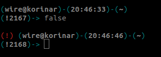
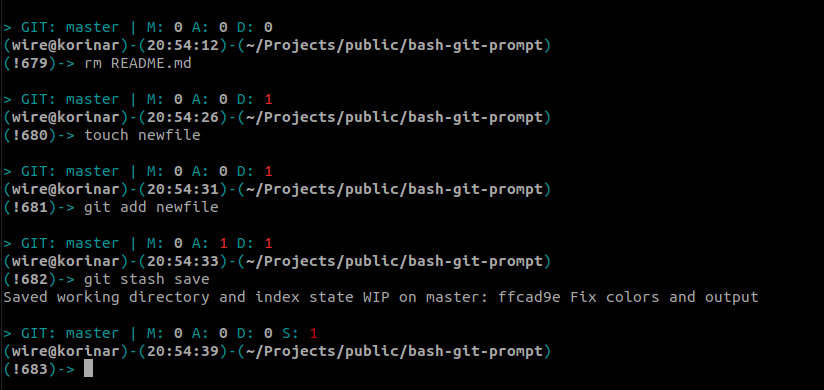
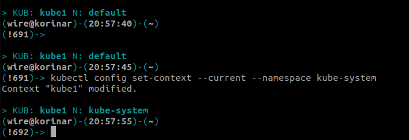
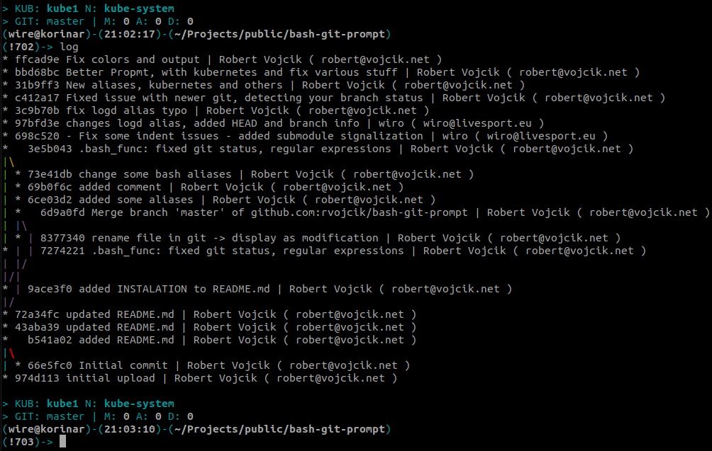
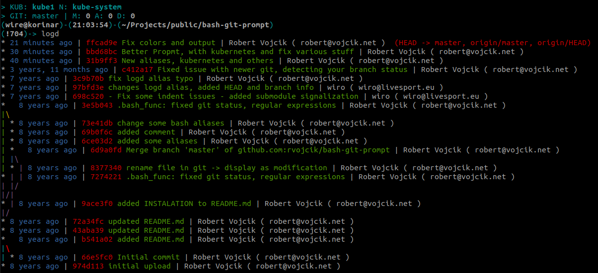

BASH Git Prompt
===============

Custom powerfull bash prompt.

* autodetection of GIT dirs
* kubernetes context name and current namespace
* various usefull functions and aliases

## Usage

### Basic prompt

You can see some basic information. From the left username@hostname, actual time, actual working directory. On the next line you can see bash command reference number of actual command. You can repeat command from history by typing this string eg `!2167`

In first we execute command false, so you can see indication on the next prompt with red sign `(!)`, it means that last command has non 0 return code.

### GIT

* Prompt automatically detect that you are in GIT repository and display some basic git info like actual REF, Modified files, Added files and Deleted file. 
* It can also detect Git Submodules and gives you indication of that
* It inform you if you have stashed changes in git
* you can turn off git prompt permanently in `.bash_func` or temporarly with `gitprompt off`

### Kubernetes

* For kubernetes you can see current active context and default namespace for that context.
* you can turn off kube prompt permanently in `.bash_func` or temporarly with `kubeprompt off`

### Some usefull aliases

**GIT**

* `log`, viz screenshot
* `logd`, viz screenshot
* `commit` for `git commit -a -m`
* `cm` for `git commit -m`
* `push` for `git push`
* `check` for `git checkout`
* `fetch` for `git fetch`
* `subup` for `git submodule update`
* `subpull` for `fit submodule foreach git pull`
* `gnew` for `git checkout -b`

**Kubernetes**

* `k` for kubectl
* `kcon` for changing kubernetes config context
* `kname` for changing default namespace for context
* `kshow` for showing all contexts

**Debian/Ubuntu packaging**

* `pkgi`, for `sudo apt-get install`
* `pkgs`, for `apt-cache search`
* `pkgr`, for `sudo apt-get remove`

**Others**

* `fuck`, run last command with sudo
* `svim`, run vim with sudo

## INSTALLATION

Copy all '.bash' files to your home directory

    git clone https://github.com/rvojcik/bash-git-prompt.git
    cd bash-git-prompt
    cp -rfp ./.bash* ~/

If you have some own customization of these files, backup them first.

    cd ~/
    mkdir backup-files
    cp -rfp ~/.bash* ~/backup-files/

